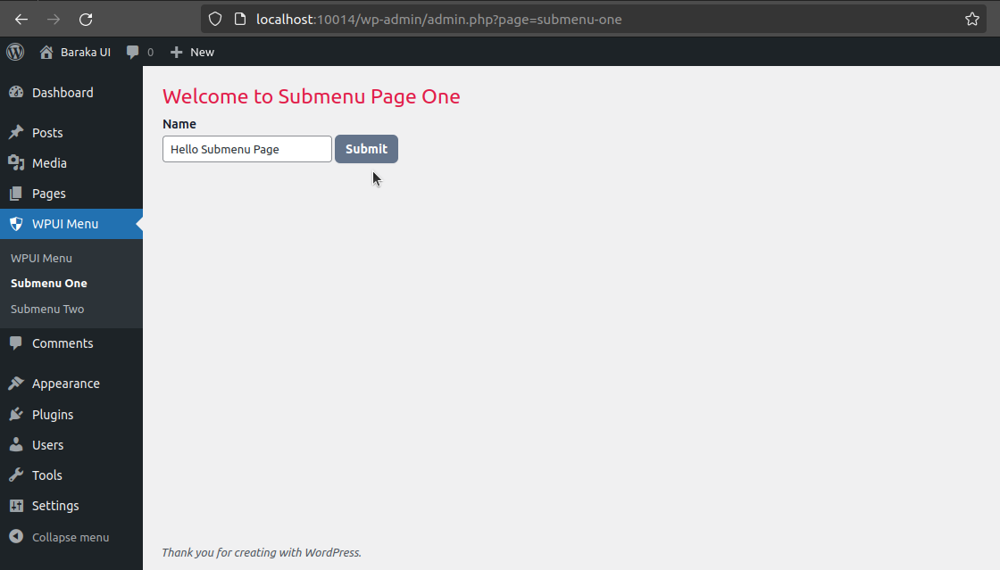
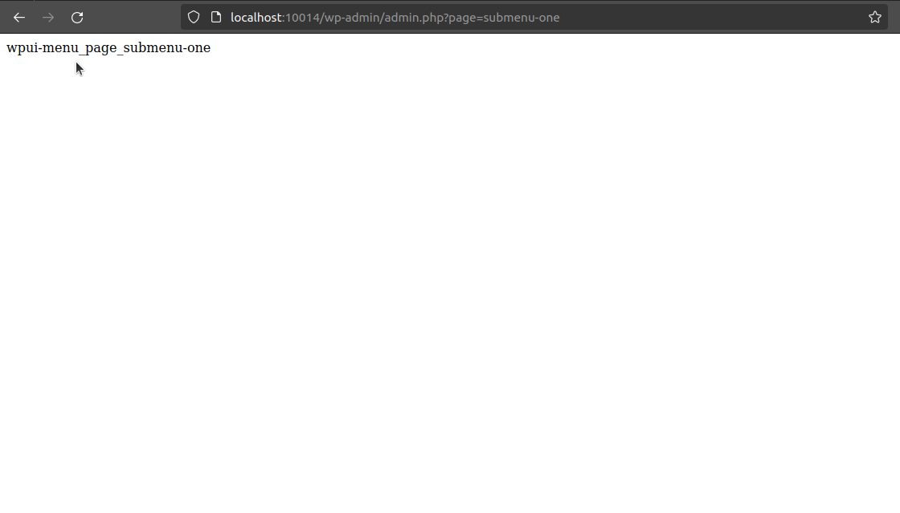
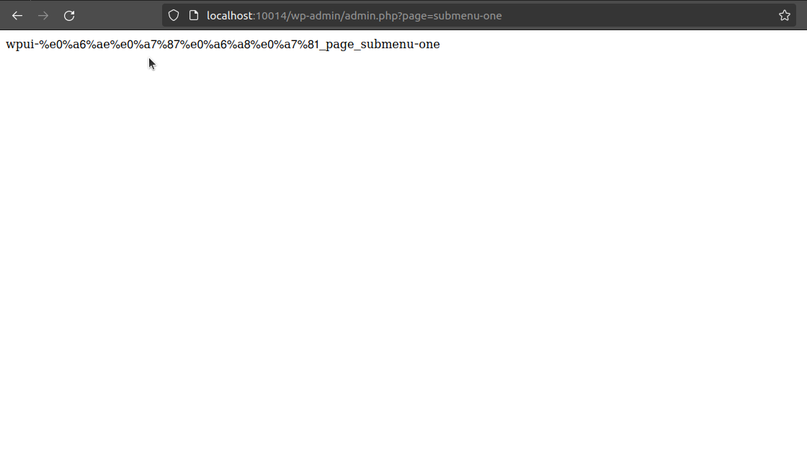

# issue 

WordPress internationalisation admin pages issue - i18n

1. The main menu page is all right
2. The submenu page enqueue scripts are not loaded
3. The submenu pages have a slug that automatically translates and converts it to URLs

**1. The main menu page is all right**
> 
> 


**2. The submenu page enqueue scripts are not loaded**
> 
> 


**3. The submenu pages have a slug that automatically translates and converts it to URLs - die($hook).**

```php
add_action('admin_enqueue_scripts', 'admin_enqueue_scripts');
function admin_enqueue_scripts( $hook ) {
    die( $hook ); // Check-in page slug
}
```
> 
> 
